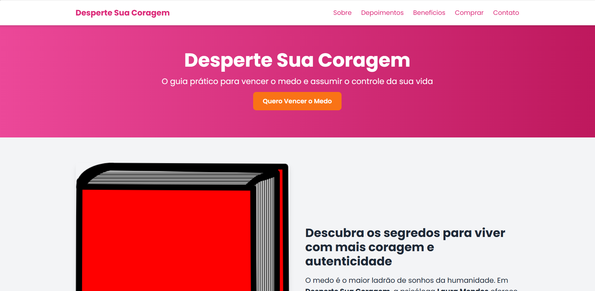
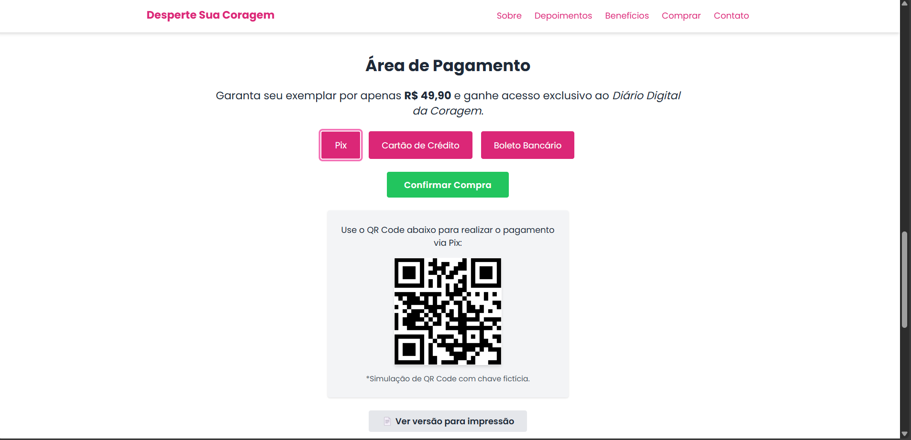

# Desperte Sua Coragem - Landing Page

Projeto de landing page responsiva e interativa para divulgação do livro fictício "Desperte Sua Coragem", de Laura Mendes. Desenvolvido como parte do portfólio para o Programa de Estágio em Engenharia de Software do QuintoAndar (Brilliant Youth).

## 🚀 Destaques do Projeto

- Layout responsivo com **Tailwind CSS** e componentes reutilizáveis
- Scroll suave e animações com `IntersectionObserver`
- Formulário com validação e envio simulado via **fetch()**
- Integração com API fake (`jsonplaceholder`) simulando backend
- Modal de confirmação de inscrição na newsletter
- Seção de pagamento com instruções dinâmicas para **Pix, Cartão e Boleto**
- **Teste unitário com Jest** para validação de e-mail e requisição `fetch()`
- **Boas práticas de acessibilidade** (a11y): `aria-label`, foco visível, contraste adequado
- Publicação via GitHub Pages

---

## 📚 Tecnologias Utilizadas

- HTML5
- CSS3 + Tailwind CSS
- JavaScript moderno (ES6+)
- Bootstrap (navbar)
- Font Awesome (icons)
- Jest + jest-fetch-mock (testes)

---

## 🔧 Como Rodar Localmente

1. Clone o repositório:
```bash
git clone https://github.com/anagabriellega/teste-landing-page.git
```

2. Instale as dependências:
```bash
cd teste-landing-page
npm install
```

3. Rode os testes:
```bash
npm test
```

4. Abra o `index.html` no navegador ou use a versão publicada.

---

## 🔍 Funcionalidades

### Newsletter:
- Validação de e-mail
- Envio de dados com `fetch()` para API fake
- Modal de sucesso

### Pagamento:
- Escolha entre Pix, Cartão e Boleto
- Instruções e elementos visuais dinâmicos para cada opção

### Testes Automatizados:
- Validação de e-mail (`isValidEmail()`)
- Mock de requisição POST usando `jest-fetch-mock`

---

## ♿ Acessibilidade (a11y)

- `aria-label` em todos os ícones e botões
- `outline` visível em foco de botões e inputs
- Contraste verificado via Lighthouse

---

## 📄 Prints / Preview

### Página Inicial


### Seção de Pagamento


[Veja ao vivo no GitHub Pages](https://anagabriellega.github.io/teste-landing-page/)

---
